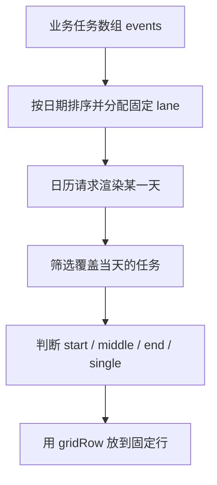
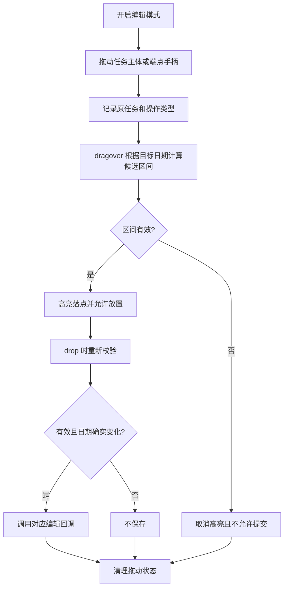
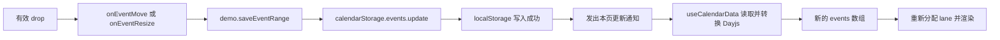

# 从零实现支持跨天对齐的任务日历

本文指导你从空目录搭建当前 demo，完成开发任务展示、重叠任务分行、跨天对齐、主题样式及可复用组件封装。示例使用 React、TypeScript、Ant Design、Emotion 和 Day.js；不需要后端服务。

按照步骤创建文件后即可运行。代码以本项目当前实现为基准，模拟数据是 2026 年 1 月的「订单后台 v2.3」迭代，不是真实业务记录。

## 效果预览

下图展示「订单后台 v2.3」在 2026 年 1 月的任务排期。颜色仅用于视觉上区分任务，不代表任务类型、状态或优先级。


可以重点观察 1 月 11 日：第一条泳道留空，订单列表任务和权限审计任务仍分别位于第二、第三条泳道。12 日新的异步导出任务进入第一条泳道，原有任务的位置保持不变。这正是后文泳道 `lane` 算法要实现的效果。

## 示例来源与 antd 5 适配背景

本教程参考了 Ant Design 6 官方 Calendar 的 [「跨日期事件」示例](https://ant-design.antgroup.com/components/calendar-cn#calendar-demo-event-range)。在 antd 6 文档中可以看到这一效果；对于仍然使用 antd 5 的内网项目，也可以沿用这种按日期绘制任务片段的思路，通过调整样式接入方式实现跨日期展示，无需仅为此功能升级到 antd 6。

**本文面向 antd 5 的实现方案：保留日期单元格自定义渲染，将 v6 的内部语义样式入口替换为局部 CSS 选择器，再加入泳道 lane 算法解决重叠任务的跨天对齐。**

### 官方示例思路如何用在 antd 5 中

跨日期任务可以拆成多个日期单元格里的片段，根据真实起止日期分别绘制首段、中间段和末段，再通过样式把相邻片段连接起来。这一实现依赖自定义渲染与 CSS 布局，不要求 Calendar 提供一个独立的“跨日期事件”数据接口。

版本之间需要适配的是样式入口。官方 Calendar API 标注：`cellRender` 从 5.4.0 开始提供，`styles`、`classNames` 从 6.0.0 开始提供，其中 `itemContent` 语义节点标注为 6.4.0。因此，迁移到 antd 5 时不能直接使用 `styles.itemContent` 或 `classNames.itemContent`。[版本依据](https://ant-design.antgroup.com/components/calendar-cn#api)

| 实现环节 | 本文在 antd 5 中的处理 |
| --- | --- |
| 日期单元格渲染 | 使用 `cellRender`，要求 antd ≥ 5.4.0 |
| 跨日期片段 | 保留 `start`、`middle`、`end`、`single` 的判断和样式 |
| 内部内容区溢出 | 通过 Emotion 根节点样式中的嵌套选择器设置 `overflow: visible` |
| 自定义类名前缀 | 使用 `getPrefixCls('picker', customizePrefixCls)`，与 Calendar 保持一致 |
| 多任务跨天对齐 | 增加固定泳道 `lane`，用 CSS Grid 保留行位与空位 |
| 业务复用 | 将数据、布局算法、样式和组件接口分别组织 |

例如，在默认前缀下，本文覆盖的内容区是 `.ant-picker-calendar-date-content`。对应的核心样式为：

```ts
calendar: css`
  &&& .${prefixCls}-calendar-date-content {
    overflow: visible;
  }
`,
```

再通过 `<Calendar css={styles.calendar} cellRender={cellRender} />` 应用。Emotion 会生成根节点 className，嵌套选择器只作用于当前日历。完整实现见第 5、6 节。

对基本跨日期效果而言，主要是调整样式接入方式；对于多个任务同时进行的业务场景，还需要处理固定行位。本文第 4 节详细介绍的**泳道 lane** 就负责这一部分：前面的任务结束后，后面的跨天任务仍留在原泳道，避免每天重新排列造成错位。

### 教程目标与仓库验证版本

当前演示仓库使用 `antd: 5.0.2`，日期渲染采用该版本支持的 `dateCellRender`。前面的 `cellRender` 说明用于理解较新版本的适配：5.4.0 及以上可以使用 `cellRender`；本文完整源码保留对 5.0.2 的支持。

在公司已有 antd 5 项目中，可保留该项目现有的 React、构建工具与依赖版本，接入本文组件并按第 8 节验证；不需要照搬演示仓库的整份 `package.json`。内部 CSS 类名、间距和跨天条接缝仍需在实际使用的 antd 5 小版本中核对。

## 1. 明确目标与实现边界

我们希望一条任务在起止日期之间每天出现，并在同一天与其他任务分行显示。同一条任务跨天时始终占据同一行；前面的任务结束后，空位仍然保留。

本 demo 将起止日期都计为占用日，使用自然日比较。跨周、跨月仍保持相同行号，但每个日期单元格各自绘制片段，不是用一个 DOM 元素横跨整个月。支持编辑模式下拖动任务两端调整日期；支持保持工作日数的任务整体移动；当前不包含标题编辑、服务端存储、按小时排程或年视图任务汇总。

实现分成三个部分：

| 部分 | 职责 | 文件 |
| --- | --- | --- |
| 业务示例 | 提供模拟任务与初始月份 | `src/demo.tsx` |
| 任务布局 | 为每条任务计算固定的 `lane` | `eventLayout.ts` |
| 通用组件 | 筛选当天任务、应用样式、透传配置 | `EventCalendar.tsx` |



## 2. 建立工程

### 2.1 环境与安装方式

本次文档核对环境为 Node.js `22.22.2`、npm `10.9.7`。教程沿用项目的 `react-scripts@5.0.1`，便于复现现有代码。

在一个新目录执行：

```bash
mkdir event-calendar-demo
cd event-calendar-demo
mkdir -p public src/components/EventCalendar
```

下面提供当前项目的依赖声明。`antd` 固定为 `5.0.2`，组件使用 `dateCellRender` 和 Emotion 嵌套选择器，不依赖 v6 的 `styles`/`classNames` 接口。`@ant-design/icons` 和 `clsx` 是现有项目保留的依赖，本实现没有直接使用它们；也不需要 `antd-style`。

创建 `package.json`：

```json
{
  "browserslist": [
    ">0.2%",
    "not dead"
  ],
  "dependencies": {
    "@ant-design/icons": "^6.3.4",
    "@emotion/react": "^11.14.0",
    "antd": "5.0.2",
    "clsx": "^2.1.1",
    "dayjs": "^1.11.11",
    "react": "^19.0.0",
    "react-dom": "^19.0.0"
  },
  "devDependencies": {
    "@types/node": "^24.0.0",
    "@types/react": "19.2.18",
    "@types/react-dom": "^19.2.3",
    "react-scripts": "^5.0.1",
    "typescript": "^5.0.2"
  },
  "main": "index.js",
  "scripts": {
    "build": "react-scripts build",
    "eject": "react-scripts eject",
    "start": "react-scripts start",
    "test": "react-scripts test --env=jsdom"
  },
  "title": "跨日期事件 - antd@6.6.3"
}
```

保存后安装：

```bash
npm install --legacy-peer-deps
```

这里显式使用 `--legacy-peer-deps`，是因为当前工程的 TypeScript 5 超出了 `react-scripts@5.0.1` 声明的 TypeScript peer 范围。它跳过 peer 冲突检查，不代表所有版本天然兼容，后面仍需执行类型检查和构建。`^` 版本声明允许更新，安装后应保存 `package-lock.json`。

如果拿到的是本项目完整代码及锁文件，使用下面的命令复现锁定依赖，不必重新建目录：

```bash
npm ci --legacy-peer-deps
```

本教程统一使用 npm。不要交替运行 npm 和 pnpm 更新同一套依赖；本项目也存在 `pnpm-lock.yaml`，但以上步骤只使用 npm 锁文件。

### 2.2 最终目录

```text
event-calendar-demo/
├── public/
│   └── index.html
├── src/
│   ├── index.tsx
│   ├── demo.tsx
│   └── components/
│       └── EventCalendar/
│           ├── index.ts
│           ├── types.ts
│           ├── eventLayout.ts
│           ├── useStyle.ts
│           └── EventCalendar.tsx
├── .gitignore
├── package.json
├── package-lock.json
└── tsconfig.json
```

`react-scripts` 要求 HTML 模板位于 `public/index.html`，业务代码位于 `src/`。把 HTML 放在根目录会出现 “Could not find a required file: index.html”。这里使用 TypeScript 入口 `src/index.tsx`，同时提供 `tsconfig.json`。[目录规则来源](https://create-react-app.dev/docs/folder-structure/)

### 2.3 页面模板与 TypeScript 配置

创建 `public/index.html`：

```html
<!DOCTYPE html>
<html lang="zh-CN" class="event-calendar-demo">
  <head>
    <meta charset="utf-8" />
    <meta name="viewport" content="width=device-width, initial-scale=1" />
    <title>开发任务日历</title>
  </head>
  <body>
    <div id="container" style="padding: 24px"></div>
  </body>
</html>
```

挂载容器 ID 必须和入口文件一致。构建工具会自动注入 JavaScript，不必手写 script 引用。

创建 `tsconfig.json`：

```json
{
  "compilerOptions": {
    "target": "es5",
    "lib": ["dom", "dom.iterable", "esnext"],
    "allowJs": true,
    "skipLibCheck": true,
    "esModuleInterop": true,
    "allowSyntheticDefaultImports": true,
    "strict": true,
    "forceConsistentCasingInFileNames": true,
    "noFallthroughCasesInSwitch": true,
    "module": "esnext",
    "moduleResolution": "node",
    "resolveJsonModule": true,
    "isolatedModules": true,
    "noEmit": true,
    "jsx": "react-jsx"
  },
  "include": ["src"]
}
```

`jsx: react-jsx` 启用 JSX 自动转换；`strict` 开启严格类型检查；`include: ["src"]` 限定源码目录。Emotion 组件还会声明自己的 JSX import source。

## 3. 定义任务模型和组件接口

先明确业务数据契约：任务具有唯一字符串 `key`、标题、Dayjs 起止日期和可选颜色。传入组件前应保证日期有效且开始不晚于结束，当前组件不会自动校验或修复错误数据。

组件继承常用 Calendar props，但移除原始单元格渲染入口，避免调用方覆盖负责对齐的布局。业务内容通过 `renderEvent` 扩展，外层任务条仍由组件管理。

创建 `src/components/EventCalendar/types.ts`：

```ts
import type { ReactNode } from 'react';
import type { CalendarProps } from 'antd';
import type { Dayjs } from 'dayjs';

export interface CalendarEvent {
  /** 在当前日历中唯一的任务标识。 */
  key: string;
  title: string;
  /** 开始日期和结束日期都计入任务占用范围。 */
  start: Dayjs;
  end: Dayjs;
  /** 默认使用当前主题的主色。 */
  color?: string;
}

/** 日期标记由业务方提供，周末由组件自动识别。 */
export interface CalendarDateMark {
  date: Dayjs;
  type: 'holiday' | 'workday' | 'leave';
  /** 悬停和无障碍说明，例如元旦、补班、年假。 */
  label?: string;
}

export interface EventRenderInfo {
  /** 当前片段是否为计入工作量的日期，供自定义渲染和点击回调使用。 */
  isWorkingDay: boolean;
  date: Dayjs;
  lane: number;
  position: 'start' | 'middle' | 'end' | 'single';
}

export type EventCalendarProps<T extends CalendarEvent = CalendarEvent> = Omit<
  CalendarProps<Dayjs>,
  | 'styles'
  | 'classNames'
  | 'cellRender'
  | 'fullCellRender'
  | 'dateCellRender'
  | 'dateFullCellRender'
  | 'monthCellRender'
  | 'monthFullCellRender'
> & {
  events: readonly T[];
  /** 编辑模式下显示起止日期拖动手柄。 */
  editable?: boolean;
  /** 整体移动时保持工作日数，由业务方保存重新计算的起止日期。 */
  onEventMove?: (event: T, range: { start: Dayjs; end: Dayjs }) => void;
  /** 两端缩放完成后由业务方保存新日期，不自动顺延工期。 */
  onEventResize?: (event: T, range: { start: Dayjs; end: Dayjs }) => void;
  /** 可同时标记调休安排和请假；补班优先于节假日、周末样式。 */
  dateMarks?: readonly CalendarDateMark[];
  /** 自定义任务在每天的片段内容，同时保留组件的布局。 */
  renderEvent?: (event: T, info: EventRenderInfo) => ReactNode;
  /** 点击任务片段时触发，由业务方展示详情；不会触发日期选择。 */
  onEventClick?: (event: T, info: EventRenderInfo) => void;
};
```

泛型 `T extends CalendarEvent` 允许任务携带 `owner`、`priority` 等业务字段，并在自定义渲染函数里保持类型推断。`readonly T[]` 表示组件不会修改传入数组。

## 4. 核心概念：泳道 lane 与固定行位分配

> **泳道 lane 是任务在时间轴上的固定纵向位置。先给整个任务分配泳道，再让它在每一天的片段使用同一个泳道，跨天才能对齐。**

### 4.1 什么是泳道

把日历展开为一张排期表：横轴是日期，纵轴是泳道。一条泳道是一条可以容纳任务的水平轨道，在每个日期单元格中对应相同编号的任务行。

`lane = 0` 表示第一条泳道，`lane = 1` 表示第二条，依此类推。任务从开始到结束都占据自己的泳道；只要日期不重叠，不同任务就可以先后复用同一条泳道。

这里的泳道是**布局坐标**：它不表示负责人、任务优先级、任务状态，也不表示日历里的第几周。日历换到下一周时，任务仍然位于日期内容区域内相同编号的任务行，并非停留在页面上相同的绝对 y 坐标。

| 概念 | 表示什么 | 示例 |
| --- | --- | --- |
| `event.key` | 任务的唯一身份 | C 无论在哪一天都叫 C |
| `event.lane` | 任务在本次布局中的泳道编号 | C 从 9 日到 13 日都在 lane 2 |
| 当天数组的 `index` | 任务在当天过滤结果中的位置 | 其他任务结束后，C 的 index 可能变成 0 |
| `gridRow` | CSS Grid 使用的行位置 | lane 2 对应 gridRow 3 |
| `laneEnds[i]` | 分配过程中第 i 条泳道最后占用的日期 | laneEnds[0] 为 9 日，则 10 日可分配新任务 |

业务方传入的任务不需要填写 `lane`，由 `assignEventLanes` 计算并附加到输出对象上。`renderEvent` 中的 `info.lane` 也来自这一计算结果。

### 4.2 泳道必须遵守的三个规则

1. **重叠隔离**：同一天仍在进行的两个任务必须使用不同泳道。
2. **跨天固定**：一个任务的所有日期片段使用相同泳道，不能因为当天任务数量减少而上移。
3. **结束后复用**：某条泳道上的任务结束后，后续任务可以复用它；首尾日期均计入占用，复用只能从结束日的下一天开始。

“泳道空了”只意味着新任务可以占用该位置，不意味着应把其他泳道上的进行中任务搬过来。这样既能复用空间，也能保留跨天对齐关系。

例如 A 在 lane 0 上于 9 日结束，C 在 lane 2 上持续到 13 日：10 日开始的新任务 D 可以放到 lane 0，但 C 仍留在 lane 2。

### 4.3 为什么每天 filter 后直接 map 会错位

假设 A 占 1 月 7–9 日，B 占 1 月 8–10 日。8 日过滤出的数组是 `[A, B]`，B 在第二行；10 日只剩 `[B]`，普通纵向列表会把 B 放到第一行。日期筛选没有错，缺少的是贯穿整个任务区间的行号。

因此先在完整任务集合上分配行号，再筛选某天任务。筛选时保留行号，不按当天数组索引重新编号。

### 4.4 如何分配和复用泳道

1. 按开始日期升序处理任务。
2. 同一天开始的任务，结束更晚的排在前面。
3. 起止日期都相同时，按唯一 `key` 排序，使结果在同一运行环境中不依赖输入顺序。
4. 用 `laneEnds[i]` 记录第 i 行最后一个任务的结束日期。
5. 为新任务寻找第一条可复用行：该行结束日期必须严格早于新任务开始日期。
6. 找到则复用；否则在末尾新增一行。更新该行结束日期，返回任务及其 `lane`。

结束日包含在占用区间内，所以 10 日结束的任务和 10 日开始的任务不能共享同一行。Day.js 的 `isBefore(date, 'day')` 按日粒度比较，能表达这一规则。[日期比较来源](https://day.js.org/docs/en/query/is-before)

创建 `src/components/EventCalendar/eventLayout.ts`：

```ts
import type { Dayjs } from 'dayjs';

interface EventRange {
  key: string;
  start: Dayjs;
  end: Dayjs;
}

export const assignEventLanes = <T extends EventRange>(events: readonly T[]) => {
  const laneEnds: Dayjs[] = [];
  const sortedEvents = [...events].sort(
    (a, b) =>
      a.start.startOf('day').valueOf() - b.start.startOf('day').valueOf() ||
      b.end.startOf('day').valueOf() - a.end.startOf('day').valueOf() ||
      a.key.localeCompare(b.key),
  );

  return sortedEvents.map((event) => {
    // 结束日仍被任务占用，泳道只能从结束日的下一天开始复用。
    const availableLane = laneEnds.findIndex((end) => end.isBefore(event.start, 'day'));
    const lane = availableLane === -1 ? laneEnds.length : availableLane;
    laneEnds[lane] = event.end;

    return { ...event, lane };
  });
};
```

### 4.5 逐步推演：任务如何进入泳道

使用四个任务说明分配过程：

| 任务 | 开始 | 结束 | 分配过程 | lane |
| --- | --- | --- | --- | --- |
| A | 1 月 7 日 | 1 月 9 日 | 没有已有行，新建 | 0 |
| B | 1 月 8 日 | 1 月 10 日 | 第 0 行尚未结束，新建 | 1 |
| C | 1 月 9 日 | 1 月 13 日 | A、B 均占用当天，新建 | 2 |
| D | 1 月 10 日 | 1 月 10 日 | 第 0 行已于 9 日结束，复用 | 0 |

`laneEnds` 是分配算法的临时状态，随每次分配更新；任务对象上的 `lane` 则保留给后续渲染：

| 处理完的任务 | laneEnds（日期均为 1 月） | 发生了什么 |
| --- | --- | --- |
| A | [9 日] | 新增 lane 0 |
| B | [9 日, 10 日] | 新增 lane 1 |
| C | [9 日, 10 日, 13 日] | 新增 lane 2；9 日仍被 A 占用 |
| D | [10 日, 10 日, 13 日] | 复用 lane 0，并更新其结束日 |

分配完成后，A 和 D 都带有 `lane: 0`，它们的日期区间没有重叠，因此不会在同一天争用位置。`laneEnds` 不需要传给 UI。

最终按日期渲染，下面每一横行就是一条泳道：

| 行位 | 1/7 | 1/8 | 1/9 | 1/10 | 1/11 | 1/12 | 1/13 |
| --- | --- | --- | --- | --- | --- | --- | --- |
| lane 0 | A | A | A | D | 空 | 空 | 空 |
| lane 1 | 空 | B | B | B | 空 | 空 | 空 |
| lane 2 | 空 | 空 | C | C | C | C | C |

11 日只有 C，但它仍在第 3 行。前两行留空是对齐要求的一部分。

```text
日期         1/10       1/11
lane 0       [ D ]      [ 空 ]
lane 1       [ B ]      [ 空 ]
lane 2       [ C ] ───→ [ C ]   同一泳道，保持对齐
```

对照前面的[演示截图](#效果预览)，1 月 11 日第一条泳道留空、12 日被新任务复用，就是同一规则在实际开发任务中的体现。

11 日筛选出的数组只有 `[C]`，所以 C 的数组下标是 0；但它的 `lane` 仍然是 2。渲染必须使用 `gridRow: C.lane + 1`，不能使用 `gridRow: index + 1`。

这些空位由 Grid 的隐式行产生，不需要往任务数组里插入空任务。空位只占据布局空间，没有任务数据，也没有业务身份。

### 4.6 为什么这个算法成立

开始日期有序，所以每一行里已经放置的任务都不晚于当前任务开始。只有上一条任务已经在更早的日期结束时才复用该行，因此同一行内不会有日期重叠。

任务分配一次 `lane` 后，渲染期间不再改变它，所以各日期上的片段能保持行号一致。当所有行都不可复用时，每行都有一个任务覆盖当前开始日，必须新增行才能避免重叠。由此，所需行数等于最大同时占用任务数；每天的视觉空位仍可能很多。

### 4.7 复杂度与稳定性的范围

设任务数为 n、使用行数为 L：排序为 O(n log n)，逐个扫描可用行为 O(nL)，总计 O(n log n + nL)，最坏为 O(n²)。存储排序结果、输出数组及行状态需要 O(n + L) 空间。

当前日历每个日期都扫描任务，渲染 D 个日期的筛选成本约为 O(Dn)。对 demo 的 15 条任务足够简单直接；大量任务时可进一步按日期建立索引。

行位固定只针对同一份任务集合。新增、删除或调整日期会重新分配，部分旧任务可能换行。如果只向组件提供当前月的子集，跨月切换时也可能换行；要求稳定时应传入一致的数据集合，或进一步设计持久行位分配。

## 5. 用 Emotion 编写样式 hook

Emotion 的 `css` 返回序列化样式对象，不能当作 className 字符串使用。组件通过 `css={styles.cell}` 或 `css={[styles.bar, rangeStyle]}` 应用样式，并在 TSX 文件首行添加 `/** @jsxImportSource @emotion/react */`。[Emotion css prop 来源](https://emotion.sh/docs/css-prop)

样式 hook 使用 `theme.useToken()` 读取 Ant Design 主题，用 `useMemo` 根据 token 生成样式。模板字符串内的尺寸 token 是数字，因此需要显式添加 `px`。

创建 `src/components/EventCalendar/useStyle.ts`：

```ts
import { useContext, useMemo } from 'react';
import { css } from '@emotion/react';
import { ConfigProvider, theme } from 'antd';

const useStyle = (customizePrefixCls?: string) => {
  const { getPrefixCls } = useContext(ConfigProvider.ConfigContext);
  const prefixCls = getPrefixCls('picker', customizePrefixCls);
  const { token } = theme.useToken();

  const styles = useMemo(() => {
    const barRadius = 999;

    const {
      controlHeight,
      marginXXS,
      controlHeightSM,
      colorTextLightSolid,
      fontSizeSM,
      paddingXS,
      marginXS,
      paddingXXS,
    } = token;

    return {
      calendar: css`
        /* 仅作用于当前日历，覆盖 Ant Design 默认的溢出设置。 */
        &&& .${prefixCls}-calendar-date-content {
          overflow: visible;
        }
      `,
      date: css`
        position: relative;
        isolation: isolate;
        &[data-drop-target='true'] {
          outline: 2px dashed ${token.colorPrimary};
          outline-offset: -2px;
        }
      `,
      holiday: css`
        &::after {
          content: '';
          position: absolute;
          z-index: -1;
          inset: 0;
          background: ${token.colorError};
          opacity: 0.08;
          pointer-events: none;
        }
      `,
      dateHeader: css`
        display: flex;
        align-items: center;
        justify-content: flex-end;
        gap: ${marginXXS}px;
      `,
      redDate: css`
        && { color: ${token.colorError}; }
      `,
      badge: css`
        display: inline-flex;
        align-items: center;
        justify-content: center;
        min-width: 18px;
        height: 18px;
        border-radius: 3px;
        color: #fff;
        font-size: 12px;
        line-height: 1;
        background: #757575;
      `,
      holidayBadge: css`
        background: ${token.colorError};
      `,
      cell: css`
        min-height: ${controlHeight}px;
      `,
      list: css`
        display: grid;
        grid-template-columns: minmax(0, 1fr);
        grid-auto-rows: calc(${controlHeightSM}px - ${marginXXS}px);
        gap: ${marginXXS}px;
        margin-top: ${marginXXS}px;
      `,
      resizeHandle: css`
        position: absolute;
        top: 0;
        bottom: 0;
        width: 14px;
        display: flex;
        align-items: center;
        justify-content: center;
        background: rgba(0, 0, 0, 0.55);
        color: #fff;
        cursor: ew-resize;
        opacity: 0;
        z-index: 1;
        &[data-resize-edge='start'] { inset-inline-start: 0; }
        &[data-resize-edge='end'] { inset-inline-end: 0; }
      `,
      bar: css`
        position: relative;
        &:hover [data-resize-edge] { opacity: 1; }
        display: block;
        height: calc(${controlHeightSM}px - ${marginXXS}px);
        overflow: hidden;
        color: ${colorTextLightSolid};
        font-size: ${fontSizeSM}px;
        white-space: nowrap;
        text-overflow: ellipsis;
      `,
      draggingBar: css`
        /* 同一任务的所有可见片段一起淡化，阴影不改变泳道布局。 */
        opacity: 0.5;
        box-shadow: 0 4px 10px rgba(0, 0, 0, 0.3);
      `,
      nonWorkingBar: css`
        /* 边框计入片段尺寸，中间片段不画左右边框，保持跨天连接。 */
        box-sizing: border-box;
        border: 1px dashed rgba(128, 128, 128, 0.5);
        border-inline-width: 0;
        background-color: rgba(128, 128, 128, 0.3);
        color: ${token.colorText};

        &[data-range-position='start'],
        &[data-range-position='single'] {
          border-inline-start-width: 1px;
        }

        &[data-range-position='end'],
        &[data-range-position='single'] {
          border-inline-end-width: 1px;
        }
      `,
      barStart: css`
        margin-inline-end: calc(-1 * (${paddingXS}px + ${marginXS}px / 2));
        padding-inline-start: calc(${paddingXXS}px + ${paddingXXS}px);
        border-start-start-radius: ${barRadius}px;
        border-end-start-radius: ${barRadius}px;
      `,
      barMiddle: css`
        margin-inline: calc(-1 * (${paddingXS}px + ${marginXS}px / 2));
      `,
      barEnd: css`
        margin-inline-start: calc(-1 * (${paddingXS}px + ${marginXS}px / 2));
        border-start-end-radius: ${barRadius}px;
        border-end-end-radius: ${barRadius}px;
      `,
      barSingle: css`
        padding-inline-start: calc(${paddingXXS}px + ${paddingXXS}px);
        border-radius: ${barRadius}px;
      `,
    };
  }, [token, prefixCls]);

  return { styles, prefixCls };
};

export default useStyle;
```

### 5.1 将逻辑泳道映射为 Grid 行

关键是单列 Grid、统一的隐式行高，以及每个任务的显式行号：

```tsx
<div css={styles.list}>
  <span style={{ gridRow: event.lane + 1 }}>任务内容</span>
</div>
```

泳道算法决定“放在哪一行”，Grid 决定“这一行在页面上如何占据空间”，两者缺一不可：只计算 lane 却继续使用普通纵向列表，仍然会错位。

CSS Grid 行号从 1 开始，算法从 0 开始，所以需要 `+ 1`。即使当天只有 `lane = 2` 的任务，Grid 也会为前两行保留固定高度和间距。`minmax(0, 1fr)` 允许列在长标题下收缩，配合省略号限制溢出。

### 5.2 任务条如何连接

| 片段位置 | 样式处理 | 默认标题 |
| --- | --- | --- |
| start | 左侧圆角，向右扩展 | 显示 |
| middle | 两侧扩展，无圆角 | 不显示 |
| end | 右侧圆角，向左扩展 | 不显示 |
| single | 两端圆角 | 显示 |

负 margin 补偿日期单元格的内边距与间隔；对日历内部 `*-calendar-date-content` 设置 `overflow: visible` 允许片段越过单元格内容区域，产生连续任务条的视觉效果。该补偿与当前 Ant Design 全尺寸日历布局有关；修改单元格 padding、紧凑模式或主题尺寸后应重新检查接缝。

算法保证的是行位。当前样式不在每周起点补画圆角或重复标题；跨周时仍依据任务真实起止日期判断片段。任务开始日在可视区外时，可能只看到没有文字的延续条，可悬停查看 `title`。

## 6. 封装 EventCalendar

当前 Calendar 的 `dateCellRender` 提供日期，我们只为日期单元格绘制任务条；年视图的月份单元格不绘制任务。[Calendar API 来源](https://ant.design/components/calendar/)

组件流程：

1. `useMemo` 根据整个 `events` 数组计算布局。
2. 在 `dateCellRender` 中筛选 `start ≤ date ≤ end` 的任务。
3. 判断片段位置，选择首段、末段或中间段样式。
4. 使用预先分配的 `lane` 定位，按任务颜色或主题主色绘制。
5. 若传入 `renderEvent`，由业务方生成片段内容。
6. 通过 Emotion 的 `css` 属性给 Calendar 根节点附加样式类，将其他 Calendar props 透传。

创建 `src/components/EventCalendar/workday.ts`：

```ts
import type { Dayjs } from 'dayjs';
import type { CalendarDateMark, CalendarEvent } from './types';

/** 请假优先；补班覆盖节假日和周末。 */
export function isWorkingDate(date: Dayjs, marks: readonly CalendarDateMark[]) {
  if (marks.some((mark) => mark.type === 'leave')) return false;
  if (marks.some((mark) => mark.type === 'workday')) return true;
  return !marks.some((mark) => mark.type === 'holiday') && date.day() !== 0 && date.day() !== 6;
}

/** 统计包含首尾日期的有效工作日数，与任务整体移动使用相同口径。 */
export function countWorkingDays(
  event: Pick<CalendarEvent, 'start' | 'end'>,
  isWorking: (date: Dayjs) => boolean,
) {
  let count = 0;
  for (let date = event.start.startOf('day'); !date.isAfter(event.end, 'day'); date = date.add(1, 'day')) {
    if (isWorking(date)) count += 1;
  }
  return count;
}

/** 保留原区间内的工作日数，落点为新开始日期，非工作日不消耗工期。 */
export function moveEventRange(
  event: Pick<CalendarEvent, 'start' | 'end'>,
  target: Dayjs,
  isWorking: (date: Dayjs) => boolean,
) {
  if (!target.isValid() || !event.start.isValid() || !event.end.isValid() || event.start.isAfter(event.end, 'day')) return null;
  let remaining = countWorkingDays(event, isWorking);
  // 没有工作量的任务不自动推算，仍可通过两端手柄调整。
  if (!remaining) return null;
  const start = target.startOf('day');
  if (start.isSame(event.start, 'day')) return { start: event.start, end: event.end };
  let end = start;
  while (remaining > 0) {
    if (isWorking(end)) remaining -= 1;
    if (remaining > 0) end = end.add(1, 'day');
  }
  return { start, end };
}
```

创建 `src/components/EventCalendar/EventCalendar.tsx`：

```tsx
/** @jsxImportSource @emotion/react */
import { useCallback, useEffect, useMemo, useRef, useState } from 'react';
import { Calendar, Tooltip, theme } from 'antd';
import type { CalendarProps } from 'antd';
import dayjs from 'dayjs';
import type { Dayjs } from 'dayjs';

import { countWorkingDays, isWorkingDate, moveEventRange } from './workday';
import { assignEventLanes } from './eventLayout';
import useStyle from './useStyle';
import type { CalendarDateMark, CalendarEvent, EventCalendarProps, EventRenderInfo } from './types';

const getRangePosition = (date: Dayjs, event: CalendarEvent): EventRenderInfo['position'] => {
  const starts = date.isSame(event.start, 'day');
  const ends = date.isSame(event.end, 'day');

  if (starts && ends) return 'single';
  if (starts) return 'start';
  if (ends) return 'end';
  return 'middle';
};

function EventCalendar<T extends CalendarEvent = CalendarEvent>({
  events,
  renderEvent,
  onEventClick,
  dateMarks,
  editable = false,
  onEventResize,
  onEventMove,
  ...calendarProps
}: EventCalendarProps<T>) {
  const [dragging, setDragging] = useState<{ event: T; edge: 'start' | 'end' | 'move' } | null>(null);
  const [dropDate, setDropDate] = useState<string | null>(null);
  const suppressClick = useRef(false);
  useEffect(() => {
    if (!editable) {
      setDragging(null);
      setDropDate(null);
    }
  }, [editable]);
  const { token } = theme.useToken();
  const { styles, prefixCls } = useStyle(calendarProps.prefixCls);
  const layoutEvents = useMemo(() => assignEventLanes(events), [events]);

  const marksByDate = useMemo(() => {
    const result = new Map<string, CalendarDateMark[]>();
    for (const mark of dateMarks ?? []) {
      const key = mark.date.format('YYYY-MM-DD');
      result.set(key, [...(result.get(key) ?? []), mark]);
    }
    return result;
  }, [dateMarks]);

  const isWorking = useCallback((date: Dayjs) =>
    isWorkingDate(date, marksByDate.get(date.format('YYYY-MM-DD')) ?? []), [marksByDate]);
  // 每条任务只计算一次提示内容，避免为每天的片段重复统计工期。
  const eventTitles = useMemo(() => new Map(events.map((event) => [
    event.key,
    [
      event.title,
      `日期：${event.start.format('YYYY-MM-DD')} 至 ${event.end.format('YYYY-MM-DD')}`,
      `任务时长：${event.end.startOf('day').diff(event.start.startOf('day'), 'day') + 1} 个自然日`,
      `有效工期：${countWorkingDays(event, isWorking)} 个工作日`,
    ].join('\n'),
  ])), [events, isWorking]);
  const resizeRange = useCallback((date: Dayjs) => {
    if (!editable || !dragging) return null;
    let range: { start: Dayjs; end: Dayjs } | null;
    if (dragging.edge === 'move') {
      if (!onEventMove) return null;
      range = moveEventRange(dragging.event, date, isWorking);
    } else {
      if (!onEventResize) return null;
      range = {
        start: dragging.edge === 'start' ? date : dragging.event.start,
        end: dragging.edge === 'end' ? date : dragging.event.end,
      };
    }
    if (!range || range.start.isAfter(range.end, 'day')) return null;
    const targets = dragging.edge === 'move' ? [range.start, range.end] : [date];
    const validRange = calendarProps.validRange;
    if (targets.some((target) => calendarProps.disabledDate?.(target) ||
      (validRange && (target.isBefore(validRange[0], 'day') || target.isAfter(validRange[1], 'day'))))) return null;
    return range;
  }, [editable, dragging, onEventResize, onEventMove, isWorking, calendarProps.disabledDate, calendarProps.validRange]);

  const dateCellRender = useCallback<NonNullable<CalendarProps<Dayjs>['dateCellRender']>>(
    (date) => {
      const isWorkingDay = isWorking(date);
      const currentEvents = layoutEvents.filter(
        (event) => !date.isBefore(event.start, 'day') && !date.isAfter(event.end, 'day'),
      );

      return (
        <div css={styles.cell}>
          <div css={styles.list}>
            {currentEvents.map((event) => {
              const position = getRangePosition(date, event);
              const rangeStyle = {
                start: styles.barStart,
                middle: styles.barMiddle,
                end: styles.barEnd,
                single: styles.barSingle,
              }[position];

              return (
                <Tooltip
                  key={event.key}
                  title={<div style={{ whiteSpace: 'pre-line' }}>{eventTitles.get(event.key)}</div>}
                  open={dragging ? false : undefined}
                >
                  <span
                    draggable={editable && Boolean(onEventMove)}
                    onDragStart={(dragEvent) => {
                      // 两端手柄会阻止冒泡，任务主体只触发整体移动。
                      if (!editable || !onEventMove) return;
                      dragEvent.stopPropagation();
                      dragEvent.dataTransfer.effectAllowed = 'move';
                      dragEvent.dataTransfer.setData('text/plain', event.key);
                      const rect = dragEvent.currentTarget.getBoundingClientRect();
                      dragEvent.dataTransfer.setDragImage(dragEvent.currentTarget,
                        Math.max(0, Math.min(rect.width, dragEvent.clientX - rect.left)),
                        Math.max(0, Math.min(rect.height, dragEvent.clientY - rect.top)));
                      suppressClick.current = true;
                      setDragging({ event, edge: 'move' });
                    }}
                    onDragEnd={() => { setDragging(null); setDropDate(null); }}
                    css={[
                      styles.bar,
                      rangeStyle,
                      !isWorkingDay && styles.nonWorkingBar,
                      dragging?.event.key === event.key && styles.draggingBar,
                    ]}
                    data-dragging={dragging?.event.key === event.key ? 'true' : undefined}
                    data-working-day={isWorkingDay}
                    data-range-position={position}
                    onPointerDown={() => { suppressClick.current = false; }}
                    role={onEventClick ? 'button' : undefined}
                    tabIndex={onEventClick ? 0 : undefined}
                    aria-label={isWorkingDay ? event.title : `${event.title}（当天不计工作量）`}
                    onClick={(clickEvent) => {
                      // 任务交互不向日期单元格冒泡，保留日历自身的日期选择逻辑。
                      clickEvent.stopPropagation();
                      if (suppressClick.current) return;
                      onEventClick?.(event, { date, lane: event.lane, position, isWorkingDay });
                    }}
                    onKeyDown={(keyEvent) => {
                      // 避免日历响应任务上的键盘操作；自定义内容自行处理内部交互。
                      keyEvent.stopPropagation();
                      if (
                        onEventClick &&
                        keyEvent.target === keyEvent.currentTarget &&
                        (keyEvent.key === 'Enter' || keyEvent.key === ' ')
                      ) {
                        keyEvent.preventDefault();
                        if (!keyEvent.repeat) {
                          onEventClick(event, { date, lane: event.lane, position, isWorkingDay });
                        }
                      }
                    }}
                    style={{
                      cursor: editable && onEventMove ? 'grab' : onEventClick ? 'pointer' : undefined,
                      backgroundColor: isWorkingDay ? event.color ?? token.colorPrimary : undefined,
                      gridRow: event.lane + 1,
                    }}
                  >
                    {editable && onEventResize && (['start', 'end'] as const).map((edge) =>
                      (position === edge || position === 'single') && (
                        <span
                          key={edge}
                          css={styles.resizeHandle}
                          data-resize-edge={edge}
                          draggable
                          title={`拖动调整${edge === 'start' ? '开始' : '结束'}日期`}
                          aria-label={`调整${event.title}的${edge === 'start' ? '开始' : '结束'}日期`}
                          onPointerDown={(pointerEvent) => pointerEvent.stopPropagation()}
                          onClick={(clickEvent) => { clickEvent.stopPropagation(); }}
                          onDragStart={(dragEvent) => {
                            dragEvent.stopPropagation();
                            dragEvent.dataTransfer.effectAllowed = 'move';
                            dragEvent.dataTransfer.setData('text/plain', event.key);
                            // 使用任务片段作为鼠标拖影，避免只显示手柄图标。
                            const bar = dragEvent.currentTarget.parentElement;
                            if (bar) {
                              const rect = bar.getBoundingClientRect();
                              dragEvent.dataTransfer.setDragImage(
                                bar,
                                Math.max(0, Math.min(rect.width, dragEvent.clientX - rect.left)),
                                Math.max(0, Math.min(rect.height, dragEvent.clientY - rect.top)),
                              );
                            }
                            suppressClick.current = true;
                            setDragging({ event, edge });
                          }}
                          onDragEnd={() => { setDragging(null); setDropDate(null); }}
                        >↔</span>
                      ),
                    )}
                    {renderEvent
                      ? renderEvent(event, { date, lane: event.lane, position, isWorkingDay })
                      : position === 'start' || position === 'single'
                        ? event.title
                        : null}
                  </span>
                </Tooltip>
              );
            })}
          </div>
        </div>
      );
    },
    [layoutEvents, isWorking, eventTitles, renderEvent, onEventClick, editable, onEventResize, onEventMove, dragging, styles, token.colorPrimary],
  );

  const dateFullCellRender = useCallback<NonNullable<CalendarProps<Dayjs>['dateFullCellRender']>>(
    (date) => {
      const marks = marksByDate.get(date.format('YYYY-MM-DD')) ?? [];
      const workday = marks.find((mark) => mark.type === 'workday');
      const holiday = !workday && marks.find((mark) => mark.type === 'holiday');
      const leave = marks.find((mark) => mark.type === 'leave');
      const isWeekend = date.day() === 0 || date.day() === 6;
      const calendarPrefix = `${prefixCls}-calendar`;

      // 保留日期内部结构和今天标记，选择、禁用及切月仍由 Calendar 处理。
      return (
        <div
          className={[
            `${prefixCls}-cell-inner`,
            `${calendarPrefix}-date`,
            date.isSame(dayjs(), 'day') ? `${calendarPrefix}-date-today` : '',
          ].filter(Boolean).join(' ')}
          css={[styles.date, holiday && styles.holiday]}
          data-drop-target={dropDate === date.format('YYYY-MM-DD') ? 'true' : undefined}
          onDragOver={(dragEvent) => {
            if (!dragging) return;
            dragEvent.preventDefault();
            dragEvent.stopPropagation();
            const range = resizeRange(date);
            dragEvent.dataTransfer.dropEffect = range ? 'move' : 'none';
            setDropDate(range ? date.format('YYYY-MM-DD') : null);
          }}
          onDragLeave={(dragEvent) => {
            if (!dragEvent.currentTarget.contains(dragEvent.relatedTarget as Node | null)) setDropDate(null);
          }}
          onDrop={(dragEvent) => {
            if (!dragging) return;
            dragEvent.preventDefault();
            dragEvent.stopPropagation();
            const range = resizeRange(date);
            const original = dragging.event;
            setDragging(null);
            setDropDate(null);
            if (range && (!range.start.isSame(original.start, 'day') || !range.end.isSame(original.end, 'day'))) {
              if (dragging.edge === 'move') onEventMove?.(original, range);
              else onEventResize?.(original, range);
            }
          }}
          data-holiday={holiday ? 'true' : undefined}
        >
          <div className={`${calendarPrefix}-date-value`} css={styles.dateHeader}>
            <span css={!workday && (holiday || isWeekend) ? styles.redDate : undefined}>
              {String(date.date()).padStart(2, '0')}
            </span>
            {holiday && (
              <span css={[styles.badge, styles.holidayBadge]} title={holiday.label ?? '节假日'} aria-label={holiday.label ?? '节假日'}>休</span>
            )}
            {workday && (
              <span css={styles.badge} title={workday.label ?? '补班'} aria-label={workday.label ?? '补班'}>班</span>
            )}
            {leave && (
              <span css={styles.badge} title={leave.label ?? '请假'} aria-label={leave.label ?? '请假'}>请</span>
            )}
          </div>
          <div className={`${calendarPrefix}-date-content`}>{dateCellRender(date)}</div>
        </div>
      );
    },
    [marksByDate, prefixCls, styles, dateCellRender, dragging, dropDate, resizeRange, onEventResize, onEventMove],
  );

  return <Calendar {...calendarProps} css={styles.calendar} dateFullCellRender={dateFullCellRender} />;
}

export default EventCalendar;
```

Ant Design 5 没有 Calendar 的 `styles` 接口，因此使用 `css={styles.calendar}`。Emotion 将其转换为根节点的 className，嵌套选择器只影响当前日历。`&&&` 提高选择器优先级，以覆盖组件默认 overflow。通过 `ConfigProvider.ConfigContext.getPrefixCls` 获取与 Calendar 一致的前缀，也兼容全局或单组件自定义 prefixCls。可以继续用 `className` 引用业务 CSS，或用 `style` 设置根节点行内样式。

此方案依据 [Ant Design 5 Calendar 源码](https://github.com/ant-design/ant-design/blob/5.29.3/components/calendar/generateCalendar.tsx) 的内部类名实现；升级组件库时应核对 DOM 类名。当前 demo 使用 antd 5.0.2，内网项目可按自己的小版本验证。

`useMemo` 的依赖是数组引用。更新任务时请创建新数组，例如 `setEvents(previous => [...previous, newEvent])`，不要原地 `push` 后仍传入同一个数组。

创建统一导出入口，使业务侧只需从组件目录导入：

创建 `src/components/EventCalendar/index.ts`：

```ts
export { default } from './EventCalendar';
export type { CalendarDateMark, CalendarEvent, EventCalendarProps, EventRenderInfo } from './types';
```

## 7. 接入真实风格的模拟任务

模拟任务围绕一次完整迭代展开：需求评审 → 前后端并行开发 → 联调 → 回归与压测 → 缺陷修复 → 验收和灰度观察。

任务颜色仅用于辅助区分不同任务，可按需设置，没有业务含义。泳道分配和跨天对齐不依赖颜色。

### 7.0 首次初始化本地存储

模拟数据集中放在 `src/data/calendarSeed.ts`，首次使用时写入 localStorage，之后刷新加载已有数据。本次页面内，只有用户操作主动调用增删改 API 才会修改数据；查询与组件重渲染不会重置或写入。demo 使用 `useCalendarData` 读取数据，不再在组件中每次生成模拟任务。

存储日期采用 `YYYY-MM-DD`，读到展示层时转回 Dayjs，避免 JSON 序列化造成自然日偏移。任务和日期标记分别封装 `query`、`get`、`insert`、`update`、`remove` 方法。查询任务时按起止日期区间是否重叠筛选，包含跨月任务。

以下三个文件与后面的 demo 一起创建。存储层使用版本字段校验数据，读取损坏内容或写入失败时报告错误。页面启动时调用 `initialize()`，仅存储键不存在时初始化模拟数据，普通读取不会自动修复或覆盖。

创建 `src/data/calendarStorage.ts`：

```ts
import dayjs from 'dayjs';
import type { CalendarDateMark } from '../components/EventCalendar';
import { initialDateMarks, initialEvents } from './calendarSeed';

/** 存储自然日字符串，避免 JSON 序列化 Dayjs 后产生时区偏移。 */
export interface StoredEvent {
  key: string;
  title: string;
  start: string;
  end: string;
  color?: string;
}

export interface StoredDateMark {
  date: string;
  type: CalendarDateMark['type'];
  label?: string;
}

interface CalendarData {
  version: 1;
  events: StoredEvent[];
  dateMarks: StoredDateMark[];
}

export const CALENDAR_STORAGE_KEY = 'event-calendar-demo:data:v1';
export const CALENDAR_STORAGE_CHANGE = 'event-calendar-demo:storage-change';

type DateQuery = { start?: string; end?: string };

function assertDate(value: unknown): asserts value is string {
  if (
    typeof value !== 'string' ||
    !/^\d{4}-\d{2}-\d{2}$/.test(value) ||
    !dayjs(value).isValid() ||
    dayjs(value).format('YYYY-MM-DD') !== value
  ) {
    throw new Error('日期必须是有效的 YYYY-MM-DD 字符串');
  }
}

function validateEvent(event: StoredEvent) {
  if (!event || typeof event.key !== 'string' || !event.key.trim() ||
      typeof event.title !== 'string' || !event.title.trim()) {
    throw new Error('任务标识和标题不能为空');
  }
  assertDate(event.start);
  assertDate(event.end);
  if (event.start > event.end) throw new Error('任务开始日期不能晚于结束日期');
  if (event.color !== undefined && typeof event.color !== 'string') throw new Error('任务颜色必须是字符串');
}

function validateMark(mark: StoredDateMark) {
  if (!mark) throw new Error('日期标记不能为空');
  assertDate(mark.date);
  if (!['holiday', 'workday', 'leave'].includes(mark.type)) throw new Error('日期标记类型无效');
  if (mark.label !== undefined && typeof mark.label !== 'string') throw new Error('标记说明必须是字符串');
}

function validateData(data: CalendarData) {
  if (!data || data.version !== 1 || !Array.isArray(data.events) || !Array.isArray(data.dateMarks)) {
    throw new Error('本地日历数据格式或版本不受支持，原数据已保留');
  }
  data.events.forEach(validateEvent);
  data.dateMarks.forEach(validateMark);
  if (new Set(data.events.map((event) => event.key)).size !== data.events.length) throw new Error('任务标识重复');
  if (new Set(data.dateMarks.map((mark) => `${mark.date}:${mark.type}`)).size !== data.dateMarks.length) {
    throw new Error('同一天的同类型标记重复');
  }
}

function validateQuery(query: DateQuery) {
  if (query.start !== undefined) assertDate(query.start);
  if (query.end !== undefined) assertDate(query.end);
  if (query.start && query.end && query.start > query.end) throw new Error('查询开始日期不能晚于结束日期');
}

/** 可注入 Storage 实现，便于测试；每次操作均读取最新数据。 */
export function createCalendarStorage(getStorage: () => Pick<Storage, 'getItem' | 'setItem'>, notify = () => {}) {
  const write = (data: CalendarData) => {
    validateData(data);
    getStorage().setItem(CALENDAR_STORAGE_KEY, JSON.stringify(data));
    // 仅在成功持久化后通知当前页面刷新。
    notify();
  };
  const seed = (): CalendarData => ({
    version: 1,
    events: initialEvents.map((event) => ({ ...event })),
    dateMarks: initialDateMarks.map((mark) => ({ ...mark })),
  });
  const read = (): CalendarData => {
    const raw = getStorage().getItem(CALENDAR_STORAGE_KEY);
    if (raw === null) throw new Error('日历存储尚未初始化');
    // 数据损坏时抛出错误，不用模拟数据覆盖已有内容。
    const data: CalendarData = JSON.parse(raw);
    validateData(data);
    return data;
  };

  return {
    /** 页面启动时传 reset 恢复模拟数据；普通查询不执行初始化或写入。 */
    initialize({ reset = false }: { reset?: boolean } = {}) {
      if (reset || getStorage().getItem(CALENDAR_STORAGE_KEY) === null) {
        const data = seed();
        write(data);
        return data;
      }
      return read();
    },
    query() { return read(); },
    events: {
      query(query: DateQuery = {}) {
        validateQuery(query);
        return read().events.filter((event) =>
          (!query.start || event.end >= query.start) && (!query.end || event.start <= query.end));
      },
      get(key: string) { return read().events.find((event) => event.key === key); },
      insert(event: StoredEvent) {
        validateEvent(event);
        const data = read();
        if (data.events.some((item) => item.key === event.key)) throw new Error('任务标识已存在');
        data.events.push({ ...event });
        write(data);
        return { ...event };
      },
      update(key: string, patch: Partial<Omit<StoredEvent, 'key'>>) {
        const data = read();
        const index = data.events.findIndex((event) => event.key === key);
        if (index === -1) throw new Error('任务不存在');
        const event = { ...data.events[index], ...patch, key };
        data.events[index] = event;
        write(data);
        return event;
      },
      remove(key: string) {
        const data = read();
        const index = data.events.findIndex((event) => event.key === key);
        if (index === -1) return false;
        data.events.splice(index, 1);
        write(data);
        return true;
      },
    },
    dateMarks: {
      query(query: DateQuery = {}) {
        validateQuery(query);
        return read().dateMarks.filter((mark) =>
          (!query.start || mark.date >= query.start) && (!query.end || mark.date <= query.end));
      },
      get(date: string, type: StoredDateMark['type']) {
        assertDate(date);
        return read().dateMarks.find((mark) => mark.date === date && mark.type === type);
      },
      insert(mark: StoredDateMark) {
        validateMark(mark);
        const data = read();
        if (data.dateMarks.some((item) => item.date === mark.date && item.type === mark.type)) {
          throw new Error('该日期的同类型标记已存在');
        }
        data.dateMarks.push({ ...mark });
        write(data);
        return { ...mark };
      },
      update(date: string, type: StoredDateMark['type'], patch: Partial<StoredDateMark>) {
        assertDate(date);
        const data = read();
        const index = data.dateMarks.findIndex((mark) => mark.date === date && mark.type === type);
        if (index === -1) throw new Error('日期标记不存在');
        const mark = { ...data.dateMarks[index], ...patch };
        data.dateMarks[index] = mark;
        write(data);
        return mark;
      },
      remove(date: string, type: StoredDateMark['type']) {
        assertDate(date);
        const data = read();
        const index = data.dateMarks.findIndex((mark) => mark.date === date && mark.type === type);
        if (index === -1) return false;
        data.dateMarks.splice(index, 1);
        write(data);
        return true;
      },
    },
  };
}

export const calendarStorage = createCalendarStorage(
  () => window.localStorage,
  () => window.dispatchEvent(new Event(CALENDAR_STORAGE_CHANGE)),
);
```

创建 `src/data/calendarSeed.ts`：

```ts
import type { StoredDateMark, StoredEvent } from './calendarStorage';

// 元旦放假与补班依据 2026 年放假安排，请假记录为演示数据。
export const initialDateMarks: StoredDateMark[] = [
  { date: '2026-01-01', type: 'holiday', label: '元旦放假' },
  { date: '2026-01-02', type: 'holiday', label: '元旦放假调休' },
  { date: '2026-01-03', type: 'holiday', label: '元旦放假' },
  { date: '2026-01-04', type: 'workday', label: '元旦补班' },
  { date: '2026-01-14', type: 'leave', label: '请假（模拟）' },
  { date: '2026-01-15', type: 'leave', label: '请假（模拟）' },
];

// 模拟订单后台 v2.3 迭代：开发、联调、测试、缺陷修复与灰度发布。
export const initialEvents: StoredEvent[] = [
  {
    key: 'scope-review',
    title: '订单后台 v2.3 需求与接口评审',
    start: '2026-01-05',
    end: '2026-01-05',
    color: '#faad14',
  },
  {
    key: 'order-query-api',
    title: '后端：订单组合筛选与分页接口',
    start: '2026-01-06',
    end: '2026-01-09',
    color: '#1677ff',
  },
  {
    key: 'order-filter-ui',
    title: '前端：订单筛选栏与 URL 状态同步',
    start: '2026-01-06',
    end: '2026-01-08',
    color: '#1677ff',
  },
  {
    key: 'order-table-ui',
    title: '前端：订单列表、排序与详情抽屉',
    start: '2026-01-09',
    end: '2026-01-14',
    color: '#1677ff',
  },
  {
    key: 'permission-api',
    title: '后端：订单导出权限与操作审计',
    start: '2026-01-08',
    end: '2026-01-13',
    color: '#1677ff',
  },
  {
    key: 'export-worker',
    title: '后端：异步导出队列与文件下载',
    start: '2026-01-11',
    end: '2026-01-17',
    color: '#1677ff',
  },
  {
    key: 'order-integration',
    title: '联调：筛选参数、分页与异常提示',
    start: '2026-01-15',
    end: '2026-01-16',
    color: '#faad14',
  },
  {
    key: 'export-ui',
    title: '前端：导出进度轮询与失败重试',
    start: '2026-01-15',
    end: '2026-01-20',
    color: '#1677ff',
  },
  {
    key: 'order-regression',
    title: '测试：订单查询与角色权限回归',
    start: '2026-01-19',
    end: '2026-01-22',
    color: '#52c41a',
  },
  {
    key: 'pagination-fix',
    title: '修复：切换筛选条件后页码未重置',
    start: '2026-01-20',
    end: '2026-01-20',
    color: '#ff4d4f',
  },
  {
    key: 'export-load-test',
    title: '测试：十万条订单导出压测',
    start: '2026-01-21',
    end: '2026-01-23',
    color: '#52c41a',
  },
  {
    key: 'export-memory-fix',
    title: '修复：大批量导出内存峰值过高',
    start: '2026-01-23',
    end: '2026-01-27',
    color: '#ff4d4f',
  },
  {
    key: 'release-acceptance',
    title: '验收：导出修复复测与发布检查',
    start: '2026-01-28',
    end: '2026-01-29',
    color: '#52c41a',
  },
  {
    key: 'production-release',
    title: '发布：订单后台 v2.3 灰度上线',
    start: '2026-01-30',
    end: '2026-01-30',
    color: '#faad14',
  },
  {
    key: 'release-observation',
    title: '观察：灰度错误率与导出队列积压',
    start: '2026-01-30',
    end: '2026-02-03',
    color: '#faad14',
  },
];
```

创建 `src/useCalendarData.ts`：

```ts
import { useCallback, useEffect, useState } from 'react';
import dayjs from 'dayjs';
import type { CalendarDateMark, CalendarEvent } from './components/EventCalendar';
import { calendarStorage, CALENDAR_STORAGE_CHANGE, CALENDAR_STORAGE_KEY } from './data/calendarStorage';

/** 将持久化记录转换为日历数据，并订阅本页及其他标签页的修改。 */
export default function useCalendarData() {
  const [data, setData] = useState<{ events: CalendarEvent[]; dateMarks: CalendarDateMark[] }>({
    events: [], dateMarks: [],
  });
  const [error, setError] = useState<string | null>(null);
  const refresh = useCallback(() => {
    try {
      const stored = calendarStorage.query();
      setData({
        events: stored.events.map((event) => ({ ...event, start: dayjs(event.start), end: dayjs(event.end) })),
        dateMarks: stored.dateMarks.map((mark) => ({ ...mark, date: dayjs(mark.date) })),
      });
      setError(null);
    } catch (cause) {
      setError(cause instanceof Error ? cause.message : '无法访问本地存储');
    }
  }, []);

  useEffect(() => {
    try {
      // 仅首次使用时写入模拟数据，刷新和重新挂载均保留已保存的修改。
      calendarStorage.initialize();
    } catch (cause) {
      setError(cause instanceof Error ? cause.message : '无法初始化本地存储');
      return;
    }
    refresh();
    const onStorage = (event: StorageEvent) => {
      if (event.key === CALENDAR_STORAGE_KEY || event.key === null) refresh();
    };
    window.addEventListener(CALENDAR_STORAGE_CHANGE, refresh);
    window.addEventListener('storage', onStorage);
    return () => {
      window.removeEventListener(CALENDAR_STORAGE_CHANGE, refresh);
      window.removeEventListener('storage', onStorage);
    };
  }, [refresh]);

  return { ...data, error, refresh };
}
```

调用示例（从 src 下的业务页面导入）：

```ts
import { calendarStorage } from './data/calendarStorage';

calendarStorage.events.query({ start: '2026-02-01', end: '2026-02-28' });
calendarStorage.events.insert({
  key: 'approval-api', title: '开发审批接口',
  start: '2026-02-04', end: '2026-02-06',
});
calendarStorage.events.update('approval-api', { end: '2026-02-09' });
calendarStorage.events.remove('approval-api');
calendarStorage.dateMarks.insert({ date: '2026-02-04', type: 'leave', label: '年假' });
```

通过 API 写入后，hook 自动刷新本页，并监听其他标签页的 storage 事件。查询返回普通记录，业务方应捕获增删改操作的异常。`get` 不存在返回 undefined，`remove` 返回布尔值，重复插入及更新不存在的记录会抛错。

本地数据只属于当前浏览器与来源，不是服务端存储，多标签页同时写入也不提供事务保证。完整接口说明见 [存储层 README](../src/data/README.md)。可运行 `node scripts/check-calendar-storage.cjs` 验证初始化、CRUD、日期查询和错误保护，该脚本不会修改真实浏览器存储。

### 7.1 从存储读取并展示任务

创建 `src/demo.tsx`：

```tsx
import React from 'react';

import { Alert, Button, Descriptions, Modal, Space } from 'antd';
import dayjs from 'dayjs';

import EventCalendar from './components/EventCalendar';
import type { CalendarEvent } from './components/EventCalendar';
import useCalendarData from './useCalendarData';
import { calendarStorage } from './data/calendarStorage';

const App: React.FC = () => {
  const { events, dateMarks, error } = useCalendarData();
  const [editable, setEditable] = React.useState(false);
  const [saveError, setSaveError] = React.useState<string | null>(null);
  const [selectedEvent, setSelectedEvent] = React.useState<CalendarEvent | null>(null);

  const saveEventRange = (event: CalendarEvent, range: { start: dayjs.Dayjs; end: dayjs.Dayjs }) => {
    try {
      calendarStorage.events.update(event.key, {
        start: range.start.format('YYYY-MM-DD'),
        end: range.end.format('YYYY-MM-DD'),
      });
      setSaveError(null);
    } catch (cause) {
      setSaveError(cause instanceof Error ? cause.message : '无法保存日期');
    }
  };

  return (
    <>
      <Space style={{ marginBottom: 16 }}>
        <Button type={editable ? 'primary' : 'default'} onClick={() => setEditable((value) => !value)} aria-pressed={editable}>
          {editable ? '退出编辑模式' : '开启编辑模式'}
        </Button>
        {editable && <span>拖动任务主体可整体移动；拖动两端 ↔ 可调整起止日期</span>}
      </Space>
      {saveError && <Alert type="error" showIcon message="任务日期保存失败" description={saveError} />}
      {error && <Alert type="error" showIcon message="日历数据读取失败" description={error} />}
      <EventCalendar
        events={events}
        editable={editable}
        onEventResize={saveEventRange}
        onEventMove={saveEventRange}
        dateMarks={dateMarks}
        defaultValue={dayjs('2026-01-01')}
        onEventClick={(event) => setSelectedEvent(event)}
      />
      <Modal
        title="任务详情"
        open={selectedEvent !== null}
        onCancel={() => setSelectedEvent(null)}
        footer={null}
      >
        {selectedEvent && (
          <Descriptions column={1}>
            <Descriptions.Item label="任务名称">{selectedEvent.title}</Descriptions.Item>
            <Descriptions.Item label="任务标识">{selectedEvent.key}</Descriptions.Item>
            <Descriptions.Item label="开始日期">
              {selectedEvent.start.format('YYYY-MM-DD')}
            </Descriptions.Item>
            <Descriptions.Item label="结束日期">
              {selectedEvent.end.format('YYYY-MM-DD')}
            </Descriptions.Item>
            <Descriptions.Item label="持续天数">
              {selectedEvent.end.startOf('day').diff(selectedEvent.start.startOf('day'), 'day') + 1} 天
            </Descriptions.Item>
          </Descriptions>
        )}
      </Modal>
    </>
  );
};

export default App;
```

这里指定初始日期为 `2026-01-01`，确保打开后能看到模拟任务。如果改为当前日期，请同步调整任务日期，否则初始月份可能没有任务。

最后创建 React 入口：

创建 `src/index.tsx`：

```tsx
import React from 'react';
import { createRoot } from 'react-dom/client';
import Demo from './demo';
import './index.css';

const container = document.getElementById('container');

if (!container) {
  throw new Error('Missing root container');
}

createRoot(container).render(<Demo />);
```

入口检查容器是否存在，既满足 TypeScript 严格空值检查，也使模板配置错误更容易定位。任务条样式集中在 hook 中；入口还引入 `index.css`，用于下面的页面滚动条占位优化。

### 7.2 点击任务，由业务方展示详情

`onEventClick(event, info)` 接收被点击的任务及片段上下文：`date` 是点击日期，`lane` 是泳道编号，`position` 是片段位置。泛型任务上的业务字段会保留。任务条的首段、中间段和末段都可以点击。

组件先调用 `stopPropagation()`，再调用外部回调，阻止点击冒泡到日期单元格。即使没有传入回调，点击任务也不会触发日期选择。日期空白区域继续由 Calendar 处理，`onSelect`、`onChange` 无需拦截或改写。

传入回调后，任务条可通过 Tab 聚焦，Enter 或空格键触发回调；键盘事件也不会冒泡到日历。自定义渲染内容若有按钮等内部交互，可以自行阻止冒泡，避免触发外层任务回调。

demo 用 `selectedEvent` 保存点击的任务，并通过声明式 `Modal` 显示标题、标识、起止日期和持续天数。通用组件不管理弹窗状态，业务方可替换为抽屉、详情页或自己的弹窗。

### 7.3 避免详情弹窗引起页面宽度变化

弹窗会锁定背景滚动。传统滚动条消失后，可用页面宽度会变化；当前弹窗依赖还会设置 body 宽度来补偿滚动条。可以用 `scrollbar-gutter: stable` 固定滚动条占位，并取消重复的宽度补偿。[属性说明](https://developer.mozilla.org/en-US/docs/Web/CSS/Reference/Properties/scrollbar-gutter)

在 HTML 根元素添加 `class="event-calendar-demo"`（上方模板已包含），创建 `src/index.css`：

```css
@supports (scrollbar-gutter: stable) {
  html.event-calendar-demo {
    /* 弹窗隐藏滚动条时仍保留占位，避免日历列宽变化。 */
    scrollbar-gutter: stable;
  }

  html.event-calendar-demo body {
    /* 浏览器已经预留空间，无需弹窗再次缩减页面宽度；保留滚动锁定。 */
    width: auto;
  }
}
```

入口通过 `import './index.css'` 加载。该规则只作用于 demo 页面，不写入可复用日历组件。`html.event-calendar-demo body` 的优先级高于当前弹窗注入的 `html body`，仅覆盖 width，不覆盖 overflow，因此背景仍然无法滚动。

`@supports` 保证只有支持该属性的浏览器才取消宽度补偿；旧浏览器继续使用弹窗原有补偿。浮层滚动条不占布局宽度，此属性不会为它额外留空。接入其他项目时应结合其滚动容器及弹窗库的补偿方式调整。

验收时分别在页面有、无纵向滚动条的情况下反复打开与关闭详情，检查日历左右边缘不移动，弹窗打开期间背景不可滚动，关闭后恢复原滚动位置。

### 7.4 标记节假日、补班、周末和请假

通过 `dateMarks` 传入日期标记，每条包含 Dayjs 类型的 `date`、`type` 和可选的 `label`；周末通过 `date.day()` 自动识别，不必手动传入。

| 标记 | type | 展示 |
| --- | --- | --- |
| 节假日及放假调休 | holiday | 日期红字、红色半透明背景，右上角红底白字“休” |
| 补班 | workday | 右上角灰底白字“班”，日期沿用普通工作日样式 |
| 周末 | 自动识别 | 日期红字，无额外背景和徽章 |
| 请假 | leave | 右上角灰底白字“请”，不改变原有日期配色 |

同一天补班优先于节假日和周末，避免补班日仍显示为休息日；请假独立显示，可以与“休”或“班”并列。同类型标记重复时使用第一条，业务方应保证数据一致。

为了同时绘制日期数字与徽章，组件通过 antd 5.0.2 的 `dateFullCellRender` 保留原有日期内部类名、日期内容容器和今天标记。任务内容仍调用原先的 `dateCellRender` 函数；任务泳道和点击隔离逻辑不变，日期选择、禁用状态和切月仍交给 Calendar。

日期标记不会生成任务、占用泳道或自动禁用日期；若要禁止某些日期选择，请使用 `disabledDate`。徽章的 `label` 用于悬停说明和无障碍名称。

示例中的 1 月 1–3 日放假、1 月 4 日补班依据 [2026 年放假安排](https://www.beijing.gov.cn/so/topics/1100000088/holiday.html)，这里的 holiday 表示放假区间，包含调休日期，不将整个区间都定义为法定节日当天。1 月 14–15 日请假是模拟数据。组件不内置全年节假日表，应由业务接口提供所需月份的日期标记。

### 7.5 非工作日的任务连续展示

节假日、周末和请假日上的任务片段显示为半透明灰色，并带有半透明灰色虚线边框，表示当天不计工作量；普通工作日和补班日使用任务原色。个人请假优先级最高，因此补班日若同时请假，仍显示灰色。

虚线边框使用 `box-sizing: border-box`，不增加片段高度；中间片段只绘制上下边框，任务起止处才补上相应侧边框，避免在相邻日期间产生竖向分隔。组件只调整片段的颜色和边框，不删除片段、不重算泳道、不改变首尾圆角和跨单元格连接。任务经过休息日仍连续可见，并保留详情点击功能。

`renderEvent` 和 `onEventClick` 的 `info.isWorkingDay` 提供当前片段是否计入工作量的标记。这是日期级展示信息，不会自动调整任务起止日期，也不会将详情中的“持续天数”（自然日）改为工作日统计。请假标记当前作用于整个日历当天的所有任务。

### 7.6 编辑模式与日期拖动

页面顶部按钮控制 `editable`。当它为 true 且提供 `onEventResize` 时，任务真实起点和终点在鼠标悬停时出现 ↔ 手柄；单日任务同时提供左右两个手柄。

拖动左端调整开始日期，右端调整结束日期。目标日期会显示虚线高亮，松开后触发 `onEventResize(event, { start, end })`。组件不直接修改 events，demo 在回调中主动调用 `calendarStorage.events.update`，成功后 hook 刷新页面；失败时展示错误并保留原任务。拖动完成后保存到 localStorage，页面刷新后加载修改后的日期。

拖动时，同一任务的所有可见片段以 50% 透明度显示并带有阴影，鼠标拖影使用被拖动的任务片段，而不是仅显示手柄。松开、取消或退出编辑模式后恢复原样式。拖动过程中不重新分配泳道或改写任务日期；松开并成功保存后，按新起止日期重新计算泳道。开始晚于结束、禁用日期及 validRange 外的目标不会提交。拖回原日期不触发更新，取消拖动也不写入。

任务手柄阻止点击和拖动冒泡，不触发详情或日期选择。当前使用桌面浏览器原生 HTML 拖放，支持当前面板中可见的跨周、相邻月份日期；不提供拖动自动翻月或触屏拖动。真实起止日期不在可视面板内时，需要先切换到相应月份。

### 7.7 整体移动任务并保持工作日工期

编辑模式下拖动任务主体，会触发独立的 `onEventMove(event, { start, end })`。拖动任意片段时，落点都作为整个任务的新开始日期，而不是按抓取片段计算偏移。两端手柄仍通过 `onEventResize` 调整单侧日期，手柄事件阻止冒泡，两种操作互不触发对方回调。

这里保持的是**原任务包含的工作日数**，自然日跨度可能变化：先统计原起止区间的有效工作日，再从落点逐日消耗相同数量的工作日，最后一个工作日作为新结束日期。周末、holiday、leave 不计数，workday 补班计数；同日请假仍优先于补班。

例如原任务有 3 个工作日，移动到周五，在没有额外标记的情况下结束于下周二。若落点本身是休息日，保留该开始日期并显示灰色片段，从后续工作日开始计数。原任务工作日数为 0 时不进行整体移动，可使用 resize 手动调整。拖回原开始日期不改变区间。

整体移动会校验新开始和自动算出的结束日期是否超出 validRange 或为 disabledDate；不允许时取消提交。节假日表必须覆盖新旧日期范围，未提供的特殊日期只按普通周末规则处理。

移动和 resize 均由 demo 的 `saveEventRange` 保存到 localStorage，刷新后保留。鼠标拖影、半透明样式和日期事件隔离继续生效。可执行 `node scripts/check-calendar-workdays.cjs` 验证工作日计算。

### 7.8 悬停查看任务时长

悬停任务任意片段时，Ant Design `Tooltip` 展示任务标题、起止日期、自然日时长及有效工作日数，均包含首尾日期。工作日统计复用 `countWorkingDays`，与整体移动一致：排除周末、节假日和请假，计入补班。任务日期或日期标记更新后提示自动重新计算。拖动期间关闭任务 Tooltip，避免遮挡目标日期；手柄保留原有的拖动操作提示。

### 7.9 任务编辑的设计与实现思路

前面几节介绍了功能接入，这一节说明这些功能如何协同。任务编辑包含两种语义：**resize 改变起止边界，允许工期变化；move 改变排期位置，保持有效工作日数。** 二者共享拖放交互和保存流程，但日期计算及回调相互独立。

#### 7.9.1 先划分职责，再实现交互

| 层次 | 负责什么 | 不在这一层处理的内容 |
| --- | --- | --- |
| demo 业务页 | 编辑开关、调用保存、展示错误和详情 | 泳道分配、拖放命中 |
| EventCalendar | 手柄、拖放状态、候选日期校验、触发回调 | localStorage 写入 |
| workday.ts | 工作日判断、工期统计、移动后的结束日期计算 | DOM 和交互状态 |
| calendarStorage | 记录校验与持久化，成功后发送通知 | 日历绘制 |
| useCalendarData | 读取数据、转回 Dayjs、通知 React 更新 | 推断用户要执行哪种编辑 |

`events` 是组件接收的业务数据，`dragging` 和 `dropDate` 是临时交互状态。拖动期间不改写 events，只有有效 drop 才向外提交，这样取消拖动无需回滚，保存失败也不会留下未经保存的新排期。

#### 7.9.2 用同一组状态表达三种拖动

组件记录 `{ event, edge }`，其中 event 是拖动开始时的任务，edge 表示操作类型：

| edge | 触发位置 | 新开始日期 | 新结束日期 | 对外回调 |
| --- | --- | --- | --- | --- |
| start | 左端手柄 | 落点日期 | 原结束日期 | onEventResize |
| end | 右端手柄 | 原开始日期 | 落点日期 | onEventResize |
| move | 任务主体任意片段 | 落点日期 | 按原工作日数推算 | onEventMove |

`dragging = null` 表示当前未拖动。`dropDate` 仅用于高亮合法落点，不表示已提交的日期。`suppressClick` 用于阻止拖放结束附近产生的点击打开任务详情，下一次正常指针按下时解除。

模式开关只控制是否提供编辑入口。关闭模式后清空临时拖动状态；开启模式但没有提供对应回调时，不启用该项编辑能力。普通任务详情与日期空白区域的选择行为继续保留。

#### 7.9.3 拖放按“开始—命中—提交—清理”执行



图中的无效状态仍允许用户继续拖向另一个日期；松开或取消时才结束本次操作。

- `dragstart`：写入拖动标识并记录原任务，使用任务片段作为鼠标拖影。
- `dragover`：读取日期单元格对应的日期，调用 `resizeRange` 计算候选结果。这个函数目前同时分派 move 和 resize，不进行存储写入。
- `drop`：重新计算并校验，确认日期有变化后只调用一个回调。不能只依赖上一次高亮状态，以免把过时的候选值保存。
- `dragend`：完成或取消后清空状态。任务条恢复透明度，目标高亮消失。

同一任务的所有可见片段按任务 key 一起淡化并显示阴影。拖动期间关闭 Tooltip；不实时改变条形长度或泳道，以免原生拖动的源节点在过程中被移除。保存后的新数据才触发条形和泳道重新计算。

#### 7.9.4 工期计算必须与非工作日展示一致

`isWorkingDate` 是统一的判断入口，灰色任务片段、Tooltip 的工作日数和整体移动都使用同一规则：请假优先，其次补班，再判断节假日与周末。

整体移动分两步：

1. `countWorkingDays` 统计原任务闭区间内的工作日数 N。
2. 从目标开始日期向后逐日遍历，仅遇到工作日才消耗一天；消耗第 N 天时得到新结束日期。

例如原任务从周一到周三，共 3 个工作日；整体移到周五后，在没有额外日期标记时依次消耗周五、下周一、下周二，新结束日就是下周二。自然日跨度变长，但有效工期不变。

resize 不调用这一顺延算法：把右端拖到周日，就以周日作为结束日，周日片段仍显示为非工作日。这样用户可以明确控制任务边界，而不会在松开手柄后看到端点又自动跳走。

落点为休息日时，move 保留该日作为开始日期，后续工作日才消耗工期。原任务为零工作日时不执行整体移动，可用 resize 调整。这些规则应在业务接入时明确，而不是由组件静默猜测工期。

#### 7.9.5 防止三类交互相互干扰

日历单元格、任务主体、resize 手柄具有嵌套关系，因此事件边界很重要：

- 手柄的拖动开始事件阻止冒泡，避免同时启动主体 move。
- 任务点击和拖放阻止冒泡，避免触发 Calendar 的日期选择与切月。
- 任务正常点击仍触发 onEventClick，拖动后的附带点击由 suppressClick 拦截。

使用正常的 React 事件处理器即可隔离这些行为，不需要覆盖日历内部的 onSelect 或 onChange，也不需要查询并修改 Calendar 的内部状态。

校验遵循两种操作的语义：resize 检查被拖动的端点，move 检查新的开始和结束日期。二者都不能造成开始晚于结束；相关目标不能被 disabledDate 禁用或超出 validRange。区间内部的非工作日允许存在，用连续灰色片段表示。

#### 7.9.6 保存是一条单向数据流



两个回调可以复用 `saveEventRange`，因为它们最终都提交 `{ start, end }`；这不意味着二者采用同一种日期计算方式。保存前将 Dayjs 转成 YYYY-MM-DD 字符串，存储层验证后一次写入整个记录集合。

写入失败时不发出成功通知，demo 展示错误，旧数据仍然保留。刷新后 `initialize()` 只在存储不存在时填入模拟数据，因此会加载已经保存的新日期。将来接入后端时，可替换业务保存函数；异步保存还需补充 pending 状态、重复提交防护与冲突处理，当前实现没有这些服务端机制。

#### 7.9.7 验证重点与当前范围

| 场景 | 预期行为 |
| --- | --- |
| 主体移动 | 仅触发 onEventMove，工作日数不变 |
| 拖动左端或右端 | 仅触发 onEventResize，另一端保持原值 |
| 跨周、跨月排期 | 根据提供的日期标记正确跳过非工作日 |
| 颠倒日期、落到禁用日期、超出范围 | 不保存 |
| 拖回原日期或取消拖动 | 不保存，视觉状态恢复 |
| 拖动任务或手柄 | 不打开详情，不触发日期选择 |
| 保存失败 | 显示错误，原日期不变 |
| 保存后刷新 | 读取新日期，初始化不覆盖 |

当前基于桌面原生 HTML 拖放，支持当前面板可见日期，不支持拖动自动翻月、触屏手势或键盘调整日期。移动后的日历跨度可以超过面板，但新结束日期仍须通过范围校验。节假日数据需要覆盖实际计算区间，否则缺失日期会按普通周末规则处理。


## 8. 启动和验收

### 8.1 执行检查

在项目根目录运行：

```bash
npx tsc --noEmit
npm run build
npm run start
```

前两条应成功退出；启动后访问终端提示的本地地址，默认是 `http://localhost:3000`。开发服务器会持续运行，结束时按 Ctrl+C。

文档生成时，当前项目的生产构建已通过；本文没有在全新的空目录重新联网安装所有依赖。复现时以自己的锁文件、类型检查和构建结果为准。

### 8.2 独立验证布局算法

为了不依赖浏览器验证核心逻辑，可创建 `scripts/check-event-layout.cjs`，粘贴以下代码。它使用项目现有 TypeScript 依赖转译纯函数，再用 Node.js 断言验证；不需要安装测试框架。这里的转译不代替 `tsc --noEmit` 的类型检查。

```js
const assert = require('node:assert/strict');
const fs = require('node:fs');
const path = require('node:path');
const vm = require('node:vm');
const ts = require('typescript');
const dayjs = require('dayjs');

const source = fs.readFileSync(
  path.resolve('src/components/EventCalendar/eventLayout.ts'),
  'utf8',
);
const output = ts.transpileModule(source, {
  compilerOptions: { module: ts.ModuleKind.CommonJS },
}).outputText;
const context = { exports: {} };
vm.runInNewContext(output, context);
const { assignEventLanes } = context.exports;

const task = (key, start, end) => ({
  key,
  start: dayjs(start),
  end: dayjs(end),
});
const input = [
  task('A', '2026-01-07', '2026-01-09'),
  task('B', '2026-01-08', '2026-01-10'),
  task('C', '2026-01-09', '2026-01-13'),
  task('D', '2026-01-10', '2026-01-10'),
  task('E', '2026-01-30', '2026-02-03'),
  task('F', '2026-01-30', '2026-01-31'),
];
const result = assignEventLanes(input);
const laneOf = (key) => result.find((event) => event.key === key).lane;
assert.equal(laneOf('A'), 0);
assert.equal(laneOf('B'), 1);
assert.equal(laneOf('C'), 2);
assert.equal(laneOf('D'), 0);
assert.equal(laneOf('E'), 0); // 同日起始，较长任务先分配
assert.equal(laneOf('F'), 1);
assert.equal(assignEventLanes([]).length, 0);
assert.ok(input.every((event) => !('lane' in event)));
const signature = (events) => JSON.stringify(
  events.map(({ key, lane }) => ({ key, lane })),
);
assert.equal(signature(result), signature(assignEventLanes([...input].reverse())));

for (
  let date = dayjs('2026-01-01');
  date.isBefore('2026-02-05');
  date = date.add(1, 'day')
) {
  const active = result.filter(
    (event) => !date.isBefore(event.start, 'day') && !date.isAfter(event.end, 'day'),
  );
  assert.equal(new Set(active.map((event) => event.lane)).size, active.length);
}
console.log('布局检查通过');
```

从项目根目录执行：

```bash
node scripts/check-event-layout.cjs
```

### 8.3 浏览器验收

纯函数检查不能证明 CSS 的实际布局，仍需在页面核对：

| 场景 | 检查方法 | 期望结果 |
| --- | --- | --- |
| 重叠任务 | 查看 1 月 8–9 日 | 多条任务占据不同行，无互相覆盖 |
| 前序任务结束 | 比较 1 月 8 日和 9 日的权限审计任务 | 较早一行的筛选栏任务结束后，权限任务不向上补位 |
| 单日任务 | 查看 1 月 20 日的页码修复 | 只有一段，左右圆角都有 |
| 跨周 | 查看跨越周末的异步导出任务 | 每天仍使用相同行位 |
| 跨月 | 查看 1 月 30 日到 2 月 3 日的灰度观察 | 切到 2 月后仍在同一行位，最后一天显示末段 |
| 点击任务 | 点击首段、中间段、末段，或聚焦后按 Enter/空格 | 打开详情，不改变选中日期，不触发日期回调 |
| 点击日期空白 | 点击没有任务条覆盖的日期区域 | 正常触发日期选择 |
| 空数据 | 临时传入 `events={[]}` | 保留日历，无任务条 |
| 长标题 | 缩小浏览器宽度 | 标题省略，不撑宽日期列；悬停显示标题 |
| 数据更新 | 以新数组替换 events | 按新数据重新分配与渲染 |

## 9. 在其他业务页面复用

完整组件目录可迁移到另一个具有相同兼容依赖的 React 项目。下面是带负责人字段的受控日历示例，可保存为 `src/TeamSchedule.tsx`：

```tsx
import { useState } from 'react';
import dayjs from 'dayjs';
import EventCalendar from './components/EventCalendar';
import type { CalendarEvent } from './components/EventCalendar';

interface TeamEvent extends CalendarEvent {
  owner: string;
}

export default function TeamSchedule({ events }: { events: readonly TeamEvent[] }) {
  const [value, setValue] = useState(dayjs('2026-01-01'));

  return (
    <EventCalendar
      events={events}
      value={value}
      onChange={setValue}
      onSelect={(date) => console.log('选择日期', date.format('YYYY-MM-DD'))}
      renderEvent={(event, { position }) =>
        position === 'start' || position === 'single'
          ? `${event.title} · ${event.owner}`
          : null
      }
    />
  );
}
```

接口返回字符串日期时，应在业务数据转换层转为 Dayjs，并检查唯一 key、无效日期与逆序区间。需要时区语义时，也在转换层统一业务时区；当前 demo 只处理本地自然日，不推断服务端时间戳应该属于哪一天。

## 10. 常见问题

| 现象 | 原因与处理 |
| --- | --- |
| 找不到 public/index.html | 将模板放在 `public/`，确认从项目根目录启动 |
| 无法解析 ./demo | 检查 `src/demo.tsx`、导入大小写及根目录 tsconfig，添加配置后重启 |
| css 属性类型错误或样式不生效 | 确认 TSX 首行的 Emotion pragma 和 `jsx: react-jsx` |
| className 变成对象 | Emotion `css()` 结果要通过 `css` 属性使用，不能交给 clsx |
| 尺寸样式无效 | CSS 模板字符串插入数字 token 时添加 px |
| 跨天任务上移 | 检查是否按当天数组下标定位，应使用预分配 lane |
| 同一天任务被放入同一行 | 复用条件必须为严格早于，不能小于等于 |
| 条形之间出现间隙或被裁切 | 核对负 margin、主题尺寸和 日期内容容器的 overflow |
| 更新任务后不变化 | 不要原地修改数组；传入新的数组引用 |
| 月份中间的延续任务不显示标题 | 当前仅真实起点显示标题，可通过 renderEvent 扩展 |
| 任务太多时超出日期格 | 当前无折叠或“更多”入口；需要额外设计周行高度或汇总交互 |
| npm 提示 peer 依赖冲突 | 使用本文的 legacy-peer-deps 安装方式，再运行类型与构建检查 |

## 11. 初始化版本控制

创建忽略文件：

创建 `.gitignore`：

```gitignore
# 依赖目录
node_modules/

# 构建与测试产物
build/
dist/
coverage/
*.tsbuildinfo
.cache/

# 本地环境变量
.env
.env.*
!.env.example

# 日志
*.log

# 编辑器历史与操作系统文件
.history/
.DS_Store
Thumbs.db
*.swp
*.swo
```

完成后可以执行：

```bash
git init
git status --short
git add .gitignore package.json package-lock.json tsconfig.json public src
git commit -m "feat: add reusable event calendar"
```

首次提交前配置自己的 Git 用户名与邮箱。应提交业务源码和 npm 锁文件，忽略 `node_modules/`、`build/`、日志及本地环境文件。

## 12. 后续扩展方向

本教程已经完成从数据到布局再到封装的实现。若业务需要更多能力，可分别增加日期索引加速、任务详情编辑、周起点标签、高密度任务折叠、服务端数据接入或数据变化后的持久行位策略。每项扩展都应保持「先统一分配行位，再按日期筛选并使用固定行号渲染」的基本流程。

快速 API 说明见 [组件 README](../src/components/EventCalendar/README.md)，完整源码见 [组件目录](../src/components/EventCalendar/)。
